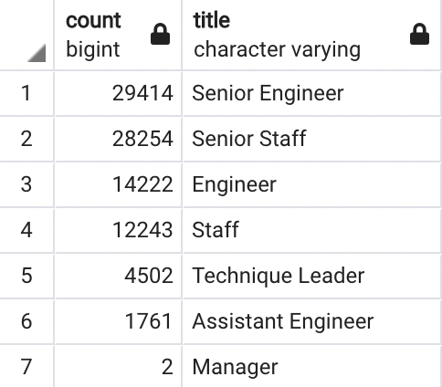
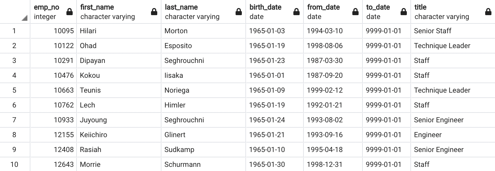
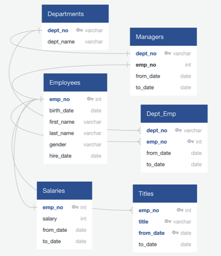

# Pewlett-Hackard-Analysis
--- 
### Background
    Complete analysis on an employee database using SQL techniques.

## What You're Creating

Consists of two technical analysis deliverables and a written report. Further description below:

- Deliverable 1: The Number of Retiring Employees by Title
- Deliverable 2: The Employees Eligible for the Mentorship Program
- Deliverable 3: A written report on the employee database analysis (README.md)

---

## Project Summary
Pewlett Hackard is preparing for a wave of retirements, let's begin our review with some particular query results which provided insight on current employees who are eligible for retirement: 

## Results

Current retirement-eligible employees have held various positions thoughout their time at Pewlett Hackard. Please see the below spread, respectively.
Seeing the scarcity of manager positions. This could be a good opportunity for stakeholders to look further into.

- With the retirment titles table we are able to see eligible employees, along with the duration per position throughout their respective careers 

- The unique titles table indicates the most recent title for retirement-eligable employees

- The retiring titles table also indicates a strong connection between retirement-eligable employees, and senior titleship

- The final part of our project provides insight on mentor-eligable employees to connect with for PH's budding mentorship programm: 

## Conclusion

Seeing a majority of PH's workforce is either retirment or mentorship-eligible - the next 5-10 years is crucial in terms of replenishing talent. They will have to allocate financial investment, and sweat equity to address this growing need via training, further-education, recruiting ...etc. The aspiring Mentorship Program is a wise idea to get started - grassroots/academy-talent is attractive and lucrative. Our queries, and tables provide insights on the hard numbers and details here - mentorship-specifically: a list of these employees, time spent with Pewlett Hackard, as well as a track record of their positions while at the company. 

### Entity Relationship Diagram (ERD)
The image below is the ERD schema that was used to build queries for this challenge.

### Code and Outputs
* Refer to "code" folder for project-related .sql queries
* Refer to "resources" folder for project-related .csv datafiles
